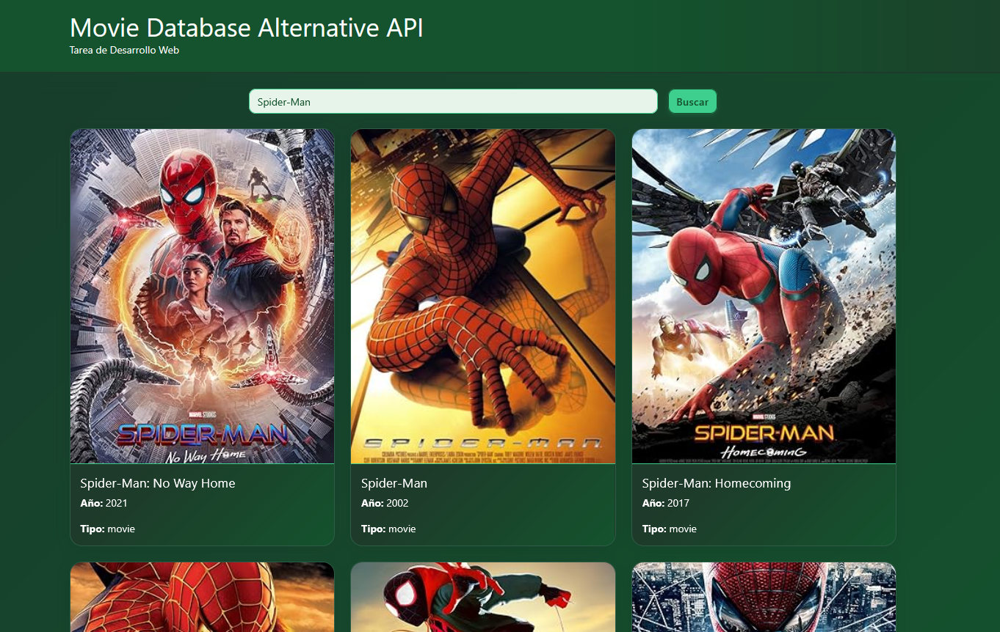

# Consumo de API de Películas

Este proyecto es una página web que permite buscar películas y series usando la Movie Database Alternative API de RapidAPI. El diseño es responsivo y utiliza Bootstrap 5 junto con estilos personalizados.



## Estructura del proyecto

```
/consumo-api
├── /public
│   ├── /css
│   │   └── bootstrap.min.css
│   ├── /js
│   │   └── bootstrap.bundle.min.js
├── index.html
├── style.css
└── script.js
```

## ¿Cómo usar?

1. Obtén tu API Key de RapidAPI para la Movie Database Alternative API.
2. Abre `script.js` y reemplaza el valor de `TU_API_KEY_AQUI` por tu clave personal.
3. Abre `index.html` en tu navegador.
4. Escribe el nombre de una película o serie y haz click en "Buscar".

## Autor

Byron Daniel Rodríguez Mazariegos
01 de Agosto de 2025
